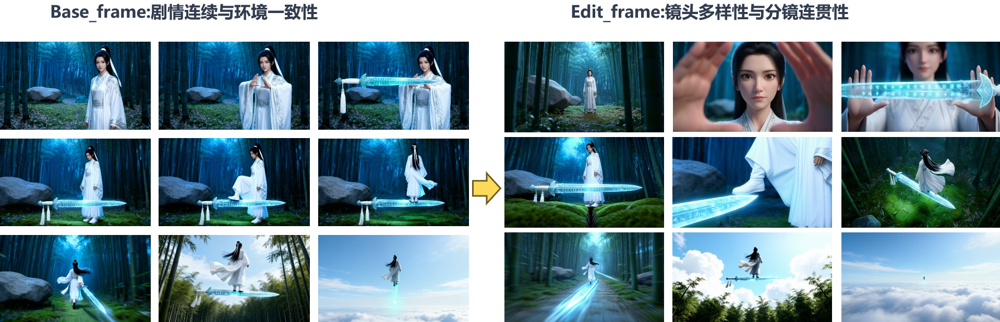
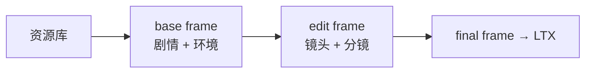
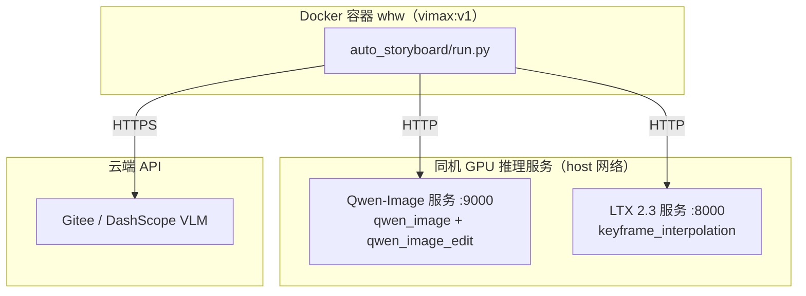

# Auto Storyboard — 多宫格参考帧 + LTX 音视频工作流

面向「创意 idea → 多宫格剧情参考帧 → LTX 音视频 shot」的端到端自动化流水线。  
参考帧阶段采用 **两阶段分工**：`case_base_frame` 锁定剧情与环境，`case_edit_frame` 负责镜头再设计与分镜衔接；LTX 阶段由大模型解析参考帧与剧情，规划每个 shot 的参考帧、`image_idxs`、prompt 及转场细节。

入口：`run.py`（CLI）  
编排：`orchestrator.py`  
LTX 扩展：`ltx_workflow.py`

---

## 工作流总览


| 阶段    | `--pipeline` | 产出                             |
| ----- | ------------ | ------------------------------ |
| 仅参考帧  | `frames`     | `case_final_frameXX.png`       |
| 仅 LTX | `video`      | `case_ltx_shot_XX_candidates/` |
| 全流程   | `full`       | 参考帧 + LTX 候选视频                 |

支持 **断点续传**：每次运行会扫描磁盘产物，将 `workflow_state.json` 中的 `step` 前推到与目录一致的阶段再继续。

---

## case_yujian效果展示




https://github.com/user-attachments/assets/b04834f1-14e6-483f-97f6-88a62985e31c
https://github.com/user-attachments/assets/b4feae7b-8619-475a-86f6-ac824931e39f


---


---

## 第一阶段：多参考帧生成

### 两阶段分工（base → edit）

第一阶段在参考帧内部再拆为两个子阶段，职责明确分离：

| 产物                  | 模型              | 核心职责                  | 具体保障                                            |
| ------------------- | --------------- | --------------------- | ----------------------------------------------- |
| `case_base_frameXX` | Qwen-Image      | **剧情连续性** + **环境一致性** | 锁定人物身份、道具状态、场景布局与光照；保证 N 宫格按剧情时间线推进，前后帧叙事可衔接    |
| `case_edit_frameXX` | Qwen-Image-Edit | **镜头多样性** + **分镜连贯性** | 在 base 剧情锚点不变的前提下做机位/景别再设计；相邻 edit 帧可组成可剪辑的镜头序列 |



设计原则：**base 管「演什么、在哪演」；edit 管「怎么拍、怎么切」**。  
edit 始终以对应 `case_base_frameXX` 为编辑输入，不重新发明剧情，只做镜头变换。

### 流程（参考帧阶段）

| 步骤       | 说明                                      | 主要产出                                    |
| -------- | --------------------------------------- | --------------------------------------- |
| 1. 初始化规划 | VLM 根据 idea 规划资源与 N 宫格剧情骨架              | `workflow_summary.json`                 |
| 2. 资源库   | 人物 / 场景 / 道具参考图（可上传或 AI 生成）             | `case_char_*.png`, `case_scene_*.png` … |
| 3. 基础九宫格 | Qwen-Image 逐帧生成剧情骨架（**base 子阶段**）       | `case_base_frame01~NN.png`              |
| 4. 再编辑   | Qwen-Image-Edit 按规划做镜头级编辑（**edit 子阶段**） | `case_edit_frame01~NN.png`              |
| 5. 最终整理  | 默认以 edit 帧作为 LTX 输入                     | `case_final_frame01~NN.png`             |

编辑阶段的逐帧 prompt 会即时写入 `frame_prompts.json`，生成过程中即可查看。

### 核心贡献

1. **基础帧生成 prompt 优化（Qwen-Image → base frame）**  
   针对正面、背面、侧面（及三分之二侧面）等人物-镜头关系做了结构化 prompt 设计，使模型能较稳定地生成正确朝向与构图，**显著降低为「朝向正确」而大量抽卡的成本**。  
   直接服务于 **剧情连续性**（人物状态、动作节点）与 **环境一致性**（场景锚点、光照）。

2. **再编辑阶段 prompt 优化（Qwen-Image-Edit → edit frame，v6.14 双段式）**  
   试验出一套高效的再编辑 prompt 范式：画面内容（Screen-Content）与镜头变换（Camera transformation）分层描述，避免冗余 `Keep` 与运镜指令冲突。  
   可在**仅引用 base 帧**的前提下完成多样化机位/景别编辑（特写、过肩、低角度等），**无需为每个镜头大量抽卡**。  
   直接服务于 **镜头多样性**（特殊机位）与 **分镜连贯性**（相邻帧可衔接为合理剪辑序列）。

### 参考帧阶段常用参数

```bash
# 仅生成 9 宫格参考帧
python run.py \
  --idea "小龙女御剑飞行，竹林到云海" \
  --case-name case_yujian \
  --grid 9 \
  --pipeline frames \
  --opening front

# 指定首帧为背影开场
python run.py --idea "..." --grid 6 --opening back --pipeline frames

# 仅重跑第 3、4 帧再编辑（会重新要 prompt 并抽卡）
python run.py --case-name case_yujian --pipeline frames --regen-edit 03,04
```

| 参数                     | 说明                                        |
| ---------------------- | ----------------------------------------- |
| `--idea`               | 创意描述，驱动 VLM 分镜与 prompt 规划                 |
| `--case-name`          | 项目名 / 输出子目录名（断点续传键）                       |
| `--output-dir`         | 输出根目录，默认上级 `qwen/`                        |
| `--grid N`             | 参考帧数量，范围 2–25，常用 4 / 6 / 9                |
| `--opening`            | 首帧人物朝向：`front` / `back` / `side` / `auto` |
| `--resources`          | 资源来源：`auto`（默认）/ `upload` / `generate`    |
| `--chars` / `--scenes` | 可选，强制人物/场景资源数量                            |
| `--regen-edit`         | 仅重跑指定编辑帧，如 `03,04`                        |
| `--vlm-provider`       | VLM 后端：`gitee` / `dashscope`              |

---

## 第二阶段：LTX 参考帧生音视频

### 目标

在已有参考帧基础上，由 VLM 规划多个 LTX shot（含长 shot 内多参考帧），调用 LTX `keyframe_interpolation` 生成候选视频，再人工选片拼接。

### 流程（LTX 阶段）

| 步骤         | 说明                                | 主要产出                           |
| ---------- | --------------------------------- | ------------------------------ |
| 6. Shot 规划 | 解析参考帧语义、动作链，分配 shot / bridge / 参数 | `ltx_shot_plan.json`           |
| 7. 视频生成    | 每 shot 并行 N 条候选 mp4               | `case_ltx_shot_XX_candidates/` |

规划遵循工作流指令文档（当前 **v1.7**：语义动作链 + 单 shot 参考帧容量 + bridge / micro-bridge + 双拼接模式）。

### 核心贡献

1. **大模型驱动的 Shot 规划**  
   VLM 读取 idea、`workflow_summary.json` 与全部参考帧，输出：
   
   - 每个 shot 使用哪些参考帧（`images`）
   - 时间锚点（`image_idxs`）、强度（`image_strengths`）、时长（`video_seconds`）
   - 英文正向 / 负向 prompt  
     并做 **语义阶段解析** 与 **参考帧容量** 校验，避免「12s 塞 6 帧」式 PPT 轮播规划。

2. **分镜衔接处的转场细节**  
   在多参考帧长 shot 及跨 shot bridge 的 prompt 中，明确要求写入**画面内可见的转场载体**（light-wipe、motion-wipe、动作桥、音频桥等），而不是空泛的 “then cuts to”。  
   使 LTX 在单段视频内部的镜头切换更连贯，跨 shot 边界可通过 **bridge / micro-action bridge** 缓解硬切。

3. **Bridge 与拼接模式（v1.4+）**  
   
   - **micro-action bridge**：高风险动作对（如脚踩飞剑）单独短 shot  
   - **transition bridge**：环境/机位跳变时的转场段  
   - **拼接模式**：`direct_concat`（整段拼接）或 `trim_overlap`（留剪辑余量）

### LTX 阶段常用参数

```bash
# 已有参考帧，只跑 LTX（默认目标时长 24s）
python run.py \
  --case-name case_yujian \
  --pipeline video \
  --video-duration 24 \
  --long-shot \
  --long-shot-seconds 12

# 全流程：参考帧 + LTX
python run.py \
  --idea "哪吒从莲花中复活" \
  --grid 9 \
  --pipeline full \
  --video-duration 30 \
  --long-shot

# 清除 LTX 缓存，保留参考帧，重新规划 shot
python run.py --case-name case_yujian --pipeline video --reset-ltx
```

| 参数                      | 说明                                 | 默认                              |
| ----------------------- | ---------------------------------- | ------------------------------- |
| `--pipeline`            | `frames` / `video` / `full`        | `frames`                        |
| `--video-duration`      | 目标成片总时长（秒）                         | video: 24；full: max(grid×6, 20) |
| `--long-shot`           | 长 shot 模式（单段内多参考帧分镜）               | 关                               |
| `--long-shot-seconds`   | 可选，强制每段主 shot 秒数                   | 由 VLM 规划                        |
| `--ltx-candidates`      | 每 shot 候选视频条数                      | 5                               |
| `--ltx-parallel`        | 同时提交 LTX 的任务上限                     | 3                               |
| `--ltx-resolution`      | `480p` / `576p` / `720p` / `1080p` | `1080p`                         |
| `--ltx-stitch-mode`     | `direct_concat` / `trim_overlap`   | `direct_concat`                 |
| `--no-generate-bridge`  | 关闭默认 bridge 候选生成                   | 默认生成                            |
| `--no-bridge-at-export` | 导出顺序不含 bridge                      | 默认含 bridge                      |
| `--no-ltx-safe-mode`    | 关闭证据约束 / 保守参数                      | 默认开启                            |
| `--reset-ltx`           | 仅重置 LTX 规划与候选                      | —                               |

完整参数说明：

```bash
python run.py --help
```

---

## 输出目录结构（单个 case）

```
qwen/<case-name>/
├── workflow_state.json          # 断点 step
├── workflow_summary.json        # 全流程摘要
├── frame_prompts.json           # 各编辑帧 prompt（即时落盘）
├── case_char_*.png              # 人物资源
├── case_scene_*.png             # 场景资源
├── case_base_frame01~NN.png     # 基础九宫格（剧情连续 + 环境一致）
├── case_edit_frame01~NN.png     # 再编辑帧（镜头多样 + 分镜连贯）
├── case_final_frame01~NN.png    # 最终参考帧（默认=edit，LTX 输入）
├── ltx_shot_plan.json           # LTX 规划与 shots 参数
├── ltx_shot_summary.json        # LTX 各 shot 摘要
├── case_ltx_shot_01_candidates/ # 候选视频
└── case_ltx_shot_01.mp4         # 人工选定成片（可选）
```

---

## Docker 环境配置（whw 容器）

**可以在新服务器上完整复现。** 详细步骤见 **[deploy/DEPLOY.md](../deploy/DEPLOY.md)**（镜像导出/导入、模型挂载、服务启动、检查清单）。

本工作流在 **Docker 容器 `whw`** 中开发与运行。容器负责跑 `auto_storyboard` CLI；GPU 推理由 **Qwen-Image 服务（:9000）** 与 **LTX 服务（:8000）** 提供（`--network=host`，通过 HTTP 调用）。

### 新服务器快速开始

```bash
# 1. 配置
cp deploy/env.example deploy/.env && vim deploy/.env

# 2. 导入镜像（先从源服务器 export，见 DEPLOY.md）
bash deploy/import_images.sh /path/to/docker_images_export

# 3. 创建 whw 容器
bash deploy/docker_run.sh

# 4. 启动 Qwen / LTX 服务后检查
source deploy/.env && bash deploy/check_services.sh

# 5. 进入容器跑工作流
docker exec -it whw bash
cd whw/seedance_fuke && python auto_storyboard/run.py --help
```

### 架构示意



| 组件                | 容器/进程                | 镜像         | 端口       | 说明                         |
| ----------------- | -------------------- | ---------- | -------- | -------------------------- |
| 工作流 CLI           | `whw`                | `vimax:v1` | —        | 跑 `run.py`，挂载 `/home/mx`   |
| Qwen-Image / Edit | `qwen_image`（或同机进程）  | `ltx2:v1`  | **9000** | 资源库、base frame、edit frame  |
| LTX 2.3           | `ltx2.3_0309`（或同机进程） | `ltx2:v1`  | **8000** | keyframe_interpolation 生视频 |
| VLM               | 云端                   | —          | —        | 分镜规划、prompt、shot 规划        |

### 1. 创建 whw 容器

推荐使用仓库内脚本（支持 `deploy/.env` 自定义挂载路径）：

```bash
cp deploy/env.example deploy/.env   # 首次配置
bash deploy/docker_run.sh           # 默认 vimax:v1 + 容器名 whw
```

等价命令（关键参数）：

```bash
sudo docker run -d -it \
  --name whw \
  --device=/dev/dri --device=/dev/mxcd \
  --group-add video \
  --network=host \
  --security-opt seccomp=unconfined \
  --security-opt apparmor=unconfined \
  --shm-size 100gb \
  --ulimit memlock=-1 \
  -v /home/mx:/home/mx \
  -v /mnt:/mnt \
  vimax:v1 /bin/bash
```

说明：

- **MetaX GPU**：需映射 `/dev/dri`、`/dev/mxcd`，并加入 `video` 组  
- **`--network=host`**：容器内可直接访问 `:9000` / `:8000` 推理服务  
- **挂载 `/home/mx`**：代码与 `qwen/<case-name>/` 产物在宿主机持久化  
- **挂载 `/mnt`**：模型权重路径（见下方服务启动脚本）

进入容器：

```bash
sudo docker exec -it whw bash
```

容器内 Python：`/opt/conda/bin/python`（3.10），已含 `aiohttp`、`openai` 等工作流依赖。

### 2. 启动 Qwen-Image 推理服务（:9000）

服务代码位于 `plin/Image/service/`（容器内路径 `/home/mx/plin/Image/service/`）：

```bash
cd /home/mx/plin/Image/service
bash launch.sh
```

`launch.sh` 会启动：

- `server.py --port 9000`：FastAPI 任务提交 / 轮询 / 下载  
- 多 GPU `worker.py`：加载 Qwen-Image-2512 与 Qwen-Image-Edit-2511  

默认模型路径（可按实际环境修改 `launch.sh`）：

- `--qwen-image-model-path /mnt/customer-fs/plin/Qwen-Image-2512`
- `--qwen-image-edit-model-path /mnt/customer-fs/plin/Qwen-Image-Edit-2511`

验证：

```bash
curl -s http://127.0.0.1:9000/docs   # 或查看 logs/log_server.log
```

### 3. 启动 LTX 2.3 推理服务（:8000）

服务代码位于 `plin/aigc_services/LTX-2_0318/service/`：

```bash
cd /home/mx/plin/aigc_services/LTX-2_0318/service
bash launch.sh
```

`launch.sh` 默认 `SERVER_PORT=8000`，启动 `keyframe_interpolation_two_stage` pipeline。  
模型路径示例（见 `launch.sh` 内 `--checkpoint-path` 等参数）。

验证：

```bash
curl -s http://127.0.0.1:8000/docs
```

### 4. 配置 auto_storyboard 连接地址

通过 `deploy/.env` 或环境变量配置（**推荐**，无需改代码）：

```bash
source deploy/.env   # 含 QWEN_IMAGE_BASE_URL、LTX_BASE_URL、API Key
```

或在容器内手动 export：

```bash
export VLM_PROVIDER=gitee
export GITEE_AI_API_KEY=your_key
export QWEN_IMAGE_BASE_URL=http://127.0.0.1:9000
export LTX_BASE_URL=http://127.0.0.1:8000
```

`config.py` 会读取上述环境变量。**勿将真实 API Key 提交到 Git**（`deploy/.env` 已加入 `.gitignore`）。

### 5. 在 whw 容器内运行工作流

```bash
cd /home/mx/whw/seedance_fuke
python auto_storyboard/run.py \
  --idea "御剑飞行穿越竹林与云海" \
  --case-name case_yujian \
  --grid 9 \
  --pipeline frames
```

### 他人复现 checklist

完整版见 [deploy/DEPLOY.md](../deploy/DEPLOY.md)。摘要：

1. 源服务器 `bash deploy/export_images.sh`，新服务器 `bash deploy/import_images.sh`
2. 拷贝模型权重与 `plin/*/service` 推理代码到 `MODEL_ROOT` / `WORKSPACE_ROOT`
3. `cp deploy/env.example deploy/.env` 并填写路径与 API Key
4. `bash deploy/docker_run.sh` 创建容器，启动 :9000 / :8000 服务
5. `bash deploy/check_services.sh` 通过后运行 `run.py`

---

## 环境与依赖

### 服务一览

| 服务                     | 用途                         | 配置                                              |
| ---------------------- | -------------------------- | ----------------------------------------------- |
| VLM（Gitee / DashScope） | 分镜规划、prompt 生成、LTX shot 规划 | `VLM_PROVIDER`, API Key                         |
| Qwen-Image             | 资源库、**base frame**（剧情+环境）  | `config.py` → `QWEN_IMAGE_BASE_URL`（默认 `:9000`） |
| Qwen-Image-Edit        | **edit frame**（镜头+分镜）      | 同上，`pipeline_name=qwen_image_edit`              |
| LTX 2.3                | 参考图插帧生视频                   | `LTX_BASE_URL`（默认 `:8000`）                      |

### 环境变量

```bash
export VLM_PROVIDER=gitee
export GITEE_AI_API_KEY=your_key
export DASHSCOPE_API_KEY=your_key
export LTX_BASE_URL=http://127.0.0.1:8000
export LTX_STITCH_MODE=direct_concat
```

### 运行（非 Docker 亦可）

只要 Python 3.10+、依赖齐全、且能访问上述 HTTP 服务，也可直接在宿主机运行：

```bash
cd seedance_fuke
python auto_storyboard/run.py --help
```

---

## 代码结构

```
auto_storyboard/
├── run.py              # CLI 入口
├── orchestrator.py     # 参考帧阶段编排（Step 1–5）
├── ltx_workflow.py     # LTX 规划与生成（Step 6–7）
├── ltx_parser.py       # 解析 VLM Shot Plan / 容量与语义校验
├── ltx_client.py       # LTX HTTP 客户端
├── vlm_client.py       # VLM 对话客户端
├── image_generator.py  # Qwen-Image / Edit 调用
├── response_parser.py  # 参考帧阶段回复解析
└── config.py           # 全局配置（部署时请改用环境变量）
```

工作流指令文档（LTX 规划规则）位于仓库上级目录，如：  
`LTX音视频生成工作流指令文档_v1.7_语义密度与动作链解析优化.md`  
参考帧 prompt 规范见多宫格分镜参考帧生成工作流文档（v6.14 等）。

---

## 典型用法示例

以下命令在 **whw 容器内**执行（路径 `/home/mx/whw/seedance_fuke`）：

```bash
# 1. 只做 9 宫格参考帧
python auto_storyboard/run.py \
  --idea "御剑飞行穿越竹林与云海" \
  --case-name case_yujian \
  --grid 9 \
  --pipeline frames

# 2. 参考帧 OK 后，生成长 shot LTX 候选（每 shot 3 条、并行 2）
python auto_storyboard/run.py \
  --case-name case_yujian \
  --pipeline video \
  --video-duration 24 \
  --long-shot --long-shot-seconds 12 \
  --ltx-candidates 3 --ltx-parallel 2

# 3. 一条命令跑完全流程
python auto_storyboard/run.py \
  --idea "哪吒复活" \
  --grid 9 \
  --pipeline full \
  --video-duration 30 \
  --long-shot
```

人工环节：预览 `*_candidates/` 中的 mp4，将选中文件复制为 `case_ltx_shot_XX.mp4`，再按 `ltx_shot_summary.json` 中的 `export_playback_order` 做后期拼接。

---

## 许可与说明

本工作流为研究与生产辅助工具，涉及第三方模型与推理服务（Qwen、LTX 等），使用前请遵守相应服务条款。  
欢迎 Issue / PR 反馈 prompt 规范与规划规则的改进建议。
